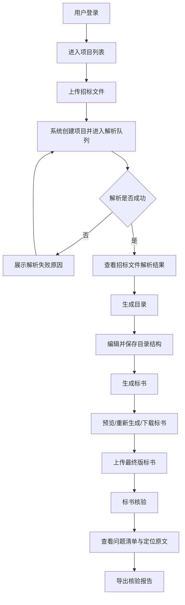

# 智能投标系统需求文档

版本：V1.1  
依据：当前静态原型页面 `index.html`、`home.html`、`analysis.html`、`outline.html`、`generate.html`、`verification.html`  
编写日期：2026-06-01

## 1. 项目概述

### 1.1 背景

投标文件制作通常包含招标文件上传、文件解析、关键条款识别、目录规划、标书内容生成、投标文件核验、报告导出等环节。当前系统定位为“AI 辅助招投标平台”，目标是通过自动解析和智能生成能力，降低人工阅读招标文件、编写标书、检查响应条款的工作量。

### 1.2 产品目标

1. 支持用户上传招标文件，并接入 DeepSeek 大模型自动解析项目关键信息、资格条件、商务要求、技术要求、评分标准、废标条款等内容。
2. 支持基于 DeepSeek 大模型解析结果生成投标文件目录，并允许用户编辑目录结构。
3. 支持基于目录和解析结果调用 DeepSeek 大模型生成标书内容，并提供在线预览、重新生成、下载标书能力。
4. 支持上传最终版标书，通过 DeepSeek 大模型对照招标文件进行语义核验，输出问题清单与核验报告。
5. 支持项目列表管理，按项目状态展示处理进度，并提供不同状态下的操作入口。

### 1.3 用户角色

| 角色 | 使用场景 | 主要权限 |
| --- | --- | --- |
| 标书专员 | 上传招标文件、查看解析结果、生成目录、生成标书、下载标书 | 项目处理全流程操作 |
| 商务经理 | 关注商务条款、付款方式、资格资质、评分标准、风险条款 | 查看解析结果、核验结果、导出报告 |
| 企业管理员 | 账号开通、用户管理、问题处理 | 原型未展示，作为后续后台能力 |

### 1.4 范围说明

本需求文档根据当前界面原型推导系统功能和业务逻辑。界面中未展开但业务必需的逻辑，例如真实文件上传、AI 解析任务、生成任务、下载文件、报告导出、用户认证等，本文以实现需求形式补充。

### 1.5 AI 大模型能力说明

本系统的核心智能能力应明确采用 AI 大模型实现，具体为接入 DeepSeek 大模型，而不是仅依赖本地固定规则、关键词匹配或硬编码模板。

1. 招标文件解析：由 DeepSeek 大模型对招标文件文本进行理解、归纳、抽取和结构化，输出项目基本信息、时间节点、资格条件、商务要求、技术要求、评分标准、废标条款、采购需求、投标文件要求等内容。
2. 目录生成：由 DeepSeek 大模型基于招标文件解析结果、投标文件要求和常见标书结构，自动生成投标文件目录初稿。
3. 标书生成：由 DeepSeek 大模型基于已确认目录、招标文件解析结果、企业资料和模板内容生成标书正文。
4. 标书核验：由 DeepSeek 大模型对招标文件要求与投标文件内容进行语义比对，识别硬性条款响应、材料缺失、报价差异、工期偏差、签章格式问题等风险。
5. 风险识别与提示：由 DeepSeek 大模型识别高风险条款、废标风险、商务风险、评分重点和需要人工确认的内容。
6. 修订建议生成：由 DeepSeek 大模型针对核验问题生成可执行的修订建议，帮助用户快速修改投标文件。
7. 报告内容生成：解析报告、核验报告中的摘要、问题说明、风险描述和建议内容可由 DeepSeek 大模型生成，系统负责格式化导出。

本地程序主要负责文件上传、格式校验、任务调度、状态流转、权限控制、数据存储、页面展示、导出排版等确定性逻辑。本地规则可作为辅助校验，例如文件类型、文件大小、金额格式、日期格式、任务状态和按钮启停，但不应替代 DeepSeek 大模型承担招标文件理解、目录生成、标书生成和语义核验能力。

## 2. 总体业务流程

### 2.1 主流程

### 2.2 项目状态机

| 状态 | 状态说明 | 进度展示 | 可用操作 | 禁用操作 |
| --- | --- | --- | --- | --- |
| 队列中 | 文件已上传，等待解析任务执行 | 0%，提示预计等待时间 | 下载招标文件 | 查看解析、生成标书、标书核验 |
| 解析中 | 系统正在抽取文本与结构化内容 | 百分比进度、预计剩余时间 | 下载招标文件、查看已部分解析结果、生成标书入口可见 | 若解析未完成，生成标书应二次确认或置灰，具体由业务决定 |
| 解析失败 | 文件格式异常或无法识别文本 | 红色进度、失败原因 | 下载招标文件、重新解析 | 生成标书、标书核验 |
| 解析完成 | 招标文件已解析完成 | 100% | 下载招标文件、查看解析、生成标书、标书核验入口 | 无 |
| 目录编辑中 | 已生成目录，用户可调整目录 | 右侧显示文档状态“编辑中” | 保存修改、编辑、子项、删除、拖拽排序、导入、导出目录、生成标书 | 无 |
| 标书生成中 | 系统根据目录生成内容 | 生成进度 | 查看生成状态 | 下载标书需等生成完成 |
| 标书已生成 | 标书内容生成完成 | 100%，显示总页数、预计阅读时间 | 查看标书、重新生成、下载标书、进入核验 | 无 |
| 待核验 | 已有招标文件解析结果，等待上传最终标书或开始核验 | 显示投标文件待核验 | 上传标书、开始核验 | 导出报告需核验完成后启用 |
| 核验完成 | 核验结果已生成 | 综合通过分、必须修复、建议确认、已通过规则、规则总数 | 定位问题、重新核验、导出核验报告、标记已处理 | 无 |

## 3. 页面与功能需求

## 3.1 登录页

对应页面：`index.html`、`login.html`

### 3.1.1 页面元素

1. 系统入口标题：智能投标系统入口。
2. 登录说明：登录后进入工作台，管理招标文件、风险识别、项目分析与团队协作。
3. 登录表单：
   - 邮箱或用户名。
   - 密码。
   - 显示/隐藏密码按钮。
   - 记住我。
   - 忘记密码。
   - 登录按钮。
4. 支持提示：遇到问题请联系企业管理员开通账号。

### 3.1.2 业务逻辑

1. 用户输入账号和密码后点击登录。
2. 前端校验账号、密码不能为空。
3. 系统向认证接口提交账号密码。
4. 登录成功后进入项目列表页。
5. 登录失败时保留账号输入，清空密码并提示失败原因。
6. 点击显示/隐藏密码时，仅切换密码输入框展示状态，不改变密码值。
7. 勾选“记住我”后，可延长登录态或记住账号，具体策略由安全规范决定。

### 3.1.3 异常处理

| 场景 | 系统处理 |
| --- | --- |
| 账号为空 | 提示“请输入账号” |
| 密码为空 | 提示“请输入密码” |
| 账号或密码错误 | 提示“账号或密码错误” |
| 用户未开通 | 提示“账号未开通，请联系企业管理员” |
| 网络异常 | 提示“登录失败，请稍后重试” |

## 3.2 项目列表页

对应页面：`home.html`

### 3.2.1 页面元素

1. 顶部导航：
   - 系统名称：智能投标系统。
   - 平台说明：AI 辅助招投标平台。
   - 通知入口。
   - 当前用户信息，例如张工、高级标书专员。
2. 上传区域：
   - 上传招标文件。
   - 支持 PDF、DOCX、DOC。
   - 单文件最大 50MB。
3. 项目列表：
   - 项目总数，例如共 12 个项目。
   - 搜索框：按项目名称搜索。
   - 排序选项：上传时间降序、上传时间升序、项目名称 A-Z。
   - 列表视图按钮。
4. 项目卡片：
   - 项目名称。
   - 上传时间。
   - 文件大小。
   - 进度条。
   - 当前状态文案。
   - 操作按钮：下载招标文件、查看解析、重新解析、生成标书、查看标书、标书核验。
5. 加载更多项目按钮。

### 3.2.2 上传招标文件逻辑

1. 用户点击上传区域或拖拽文件到上传区域。
2. 系统校验文件格式，仅支持 PDF、DOCX、DOC。
3. 系统校验文件大小，单文件最大 50MB。
4. 校验通过后创建项目记录。
5. 项目进入“队列中”状态。
6. 系统启动 DeepSeek 大模型解析任务，状态从“队列中”变更为“解析中”。
7. 解析任务应先完成文件文本提取，再将文本、表格、章节结构和必要上下文提交给 DeepSeek 大模型进行理解和结构化抽取。
8. 解析完成后状态变为“解析完成”；解析失败则状态变为“解析失败”。

### 3.2.3 项目卡片状态逻辑

1. 队列中项目：
   - 显示“队列中，预计等待 X 分钟”。
   - 进度为 0%。
   - 允许下载招标文件。
   - 查看解析、生成标书、标书核验不可点击。
2. 解析中项目：
   - 显示预计剩余时间和百分比。
   - 进度条使用进行中样式。
   - 允许查看解析，展示当前可用的部分解析结果或解析进度页。
   - 生成标书入口可展示，但真实系统应在解析完成后启用。
3. 解析失败项目：
   - 显示失败原因，例如“文件格式异常，无法识别文本内容”。
   - 允许重新解析。
   - 生成标书和标书核验不可点击。
4. 解析完成但未生成标书：
   - 显示 100%。
   - 按钮显示“生成标书”。
   - 点击后进入目录生成页。
5. 标书已生成项目：
   - 显示 100%。
   - 按钮显示“查看标书”。
   - 点击后进入标书生成页。
   - 可进入标书核验页。

### 3.2.4 搜索与排序逻辑

1. 搜索框按项目名称模糊匹配。
2. 搜索时保留当前排序条件。
3. 清空搜索框后恢复完整列表。
4. 排序支持：
   - 上传时间降序：最新上传在前。
   - 上传时间升序：最早上传在前。
   - 项目名称 A-Z：按项目名称字母、数字、中文拼音或数据库排序规则排列。
5. 点击加载更多时加载下一页项目，并追加到当前列表。

## 3.3 招标文件解析结果页

对应页面：`analysis.html`

### 3.3.1 页面元素

1. 顶部栏：
   - 系统名称。
   - 流程进度：生成目录、生成标书。
   - 通知、帮助、用户信息。
2. 解析结果导航：
   - 项目基本信息。
   - 重要时间节点。
   - 资格条件。
   - 商务要求。
   - 技术要求。
   - 评分标准。
   - 废标条款。
   - 采购需求。
   - 投标文件要求。
3. 摘要信息：
   - 评分重点，例如技术 60%。
   - 高优先级风险，例如 3 项。
4. 底部固定栏：
   - 解析时间。
   - 已提取解析项数量，例如 48 个。
   - 导出 DOCX、导出 Excel、导出 PDF。

### 3.3.2 解析内容模块

招标文件解析模块必须接入 DeepSeek 大模型完成。系统不应仅通过本地关键词、正则表达式或固定规则来判断招标文件内容。本地解析程序可负责 PDF/DOCX/DOC 文本提取、页码映射、表格拆分和段落切片，DeepSeek 大模型负责理解招标文件语义、抽取字段、归纳条款、识别风险并输出结构化结果。

#### 项目基本信息

字段包括：

| 字段 | 示例 |
| --- | --- |
| 项目名称 | 2023 年智慧政务大厅升级改造采购项目 |
| 采购人 | 某市人民政府政务服务中心 |
| 采购方式 | 公开招标 |
| 预算金额 | ¥5,000,000.00 |
| 最高限价 | ¥5,000,000.00 |
| 工期/期限 | 180 日历天 |
| 所属行业 | 软件和信息技术服务业 |
| 投标保证金 | 不要求缴纳 |

#### 重要时间节点

系统需识别并结构化：

1. 招标公告发布时间。
2. 现场踏勘或公开答疑时间地点。
3. 质疑截止日期。
4. 投标截止或开标时间。
5. 对逾期投递、即将截止、高风险节点进行醒目标记。

#### 资格条件

系统需识别：

1. 准入门槛：独立法人资格、注册资金、无重大违法记录等。
2. 资质要求：涉密资质、CMMI、ISO 体系证书等。
3. 证书名称、要求级别、必要性。
4. 必需项应标记为高优先级。

#### 商务要求

系统需识别：

1. 付款方式和付款比例。
2. 售后服务要求。
3. 风险条款，例如违约金比例高于行业平均水平。
4. 对履约成本、服务响应、付款条件等风险项进行提示。

#### 技术要求

系统需识别：

1. 性能指标，例如并发用户数、响应速度。
2. 安全要求，例如等保三级、国密算法。
3. 浏览器兼容要求。
4. 信创数据库或国产化适配要求。
5. 长文本支持展开全文和收起全文。

#### 评分标准

系统需识别：

1. 分值构成：技术方案、商务资信、价格评分等。
2. 评分项名称、分值、评分细则。
3. 价格评分方法，例如低价优先法。
4. 对恶意低价、评分重点、可得分空间进行提示。

#### 废标条款

系统需识别：

1. 资格废标条款。
2. 技术废标条款。
3. 带星号或“实质性响应”的强制条款。
4. 缺少材料、负偏离、响应缺漏等风险。

#### 采购需求

系统需识别：

1. 项目总体概况。
2. 核心软硬件清单。
3. 数量、规格、技术参数。

#### 投标文件要求

系统需识别：

1. 文件组成。
2. 份数要求。
3. 必要性。
4. 附件清单、页码、公章、签字要求。

### 3.3.3 页面交互逻辑

1. 点击顶部系统名称返回项目列表页。
2. 点击“生成目录”进入目录生成页。
3. 点击“生成标书”进入标书生成页，若未生成目录，系统应先引导进入目录生成页。
4. 点击解析导航项时，页面滚动至对应模块，并高亮当前导航项。
5. 点击技术要求中的“展开全文”时，展示完整文本，再次点击收起。
6. 点击导出 DOCX/Excel/PDF 时，生成对应格式的解析报告。

### 3.3.4 导出逻辑

1. 导出 DOCX：生成可编辑的解析报告，包含所有解析模块。
2. 导出 Excel：生成结构化表格，适合后续筛选和核对。
3. 导出 PDF：生成版式固定的报告，适合归档或传阅。
4. 导出文件命名建议：`项目名称_招标文件解析报告_YYYYMMDDHHmm.ext`。

## 3.4 目录生成页

对应页面：`outline.html`

### 3.4.1 页面元素

1. 顶部流程：
   - 第 1 步：生成目录，当前高亮。
   - 第 2 步：生成标书。
2. 目录结构编辑区：
   - 标题：目录结构编辑。
   - 章节数量，例如 5 Chapters。
   - 批量编辑。
   - 批量删除。
   - 从 Word 导入。
   - 导出目录。
3. 目录树：
   - 第 1 章：投标函。
   - 第 2 章：法定代表人身份证明。
   - 2.1 法定代表人身份证复印件。
   - 2.2 授权委托书。
   - 第 3 章：投标报价表。
   - 第 4 章：技术方案。
   - 4.1 项目概述。
   - 4.2 技术架构。
   - 4.3 实施方案。
   - 第 5 章：商务条款。
4. 单项操作：
   - 编辑。
   - 子项。
   - 删除。
   - 拖拽排序。
5. 右侧信息区：
   - 项目名称。
   - 最后保存时间。
   - 文档状态：编辑中。
   - 操作提示。
   - 保存修改。
   - 生成标书。

### 3.4.2 目录生成逻辑

1. 用户从解析结果页或项目列表页点击“生成标书”后，系统先检查项目是否已有目录。
2. 若无目录，系统调用 DeepSeek 大模型，根据招标文件解析结果自动生成初始目录。
3. 初始目录应覆盖招标文件要求的必备章节、资格材料、商务响应、技术响应、报价文件等。
4. 系统应标记目录来源：
   - DeepSeek 大模型自动生成。
   - 用户手动新增。
   - Word 导入。
5. DeepSeek 大模型生成目录时，应结合招标文件中的投标文件组成、评分标准、废标条款和附件清单，避免遗漏强制章节。
6. 用户可对目录结构进行调整，调整后进入“编辑中”状态。

### 3.4.3 目录编辑逻辑

1. 编辑：
   - 可修改章节名称。
   - 可修改章节编号。
   - 可修改章节类型，例如投标函、资格材料、商务、技术、报价。
2. 子项：
   - 可在当前章节下新增下级目录。
   - 新增后自动生成编号。
3. 删除：
   - 删除章节前需二次确认。
   - 若章节包含子项，需提示将一并删除。
   - 对必需章节删除时需提示风险，建议不允许直接删除或要求确认原因。
4. 拖拽排序：
   - 支持同级排序。
   - 支持章节移动到其他父级。
   - 排序后自动重排编号。
5. 批量编辑：
   - 可批量修改章节类型、是否生成正文、是否参与核验。
6. 批量删除：
   - 可选择多个章节后删除。
   - 必需章节应有风险提示。
7. 从 Word 导入：
   - 上传 Word 文件并识别标题层级。
   - 支持预览导入结果。
   - 用户确认后覆盖或合并当前目录。
8. 导出目录：
   - 导出当前目录为 Word、Excel 或文本。

### 3.4.4 保存与生成标书逻辑

1. 点击“保存修改”：
   - 校验目录不能为空。
   - 校验章节名称不能为空。
   - 校验章节编号不能重复。
   - 保存目录版本。
   - 更新最后保存时间。
2. 点击“生成标书”：
   - 若目录有未保存改动，先自动保存或提示用户保存。
   - 校验必需章节完整。
   - 创建标书生成任务。
   - 跳转到标书生成页。

## 3.5 标书生成页

对应页面：`generate.html`

### 3.5.1 页面元素

1. 左侧目录：
   - 展示生成后的标书目录树。
   - 支持搜索、展开、收起、目录视图切换。
2. 中间预览：
   - 展示文档页面。
   - 当前示例为“投标函”。
   - 展示项目名称、投标报价、投标有效期、投标保证金、承诺事项、技术方案概要、盖章签字日期等内容。
3. 右侧信息：
   - 项目名称。
   - 最后保存时间。
   - 文档状态：生成完成。
   - 生成状态：标书内容生成已完成。
   - 进度 100%。
   - 总页数，例如 42。
   - 预计阅读，例如 15 min。
   - 重新生成。
   - 下载标书。

### 3.5.2 标书生成逻辑

1. 输入：
   - 招标文件解析结果。
   - 用户确认后的目录结构。
   - 企业资质资料库。
   - 历史标书模板。
   - 项目基础信息。
2. 生成过程：
   - 系统调用 DeepSeek 大模型按目录逐章生成正文。
   - 对必需章节优先生成。
   - 引用解析结果中的关键条款。
   - 自动填充项目名称、采购人、投标报价、工期、投标有效期、保证金、服务承诺等字段。
   - DeepSeek 大模型应根据招标要求生成针对性响应内容，不能只套用通用模板。
   - 系统对大模型输出内容进行基础格式处理、章节拼装、版本保存和 Word 导出。
3. 输出：
   - 在线预览文档。
   - 可下载的 DOCX 标书文件。
   - 生成任务状态和统计信息。

### 3.5.3 预览逻辑

1. 点击左侧目录节点时，中间预览滚动到对应章节。
2. 当前章节在目录中高亮。
3. 文档预览应尽量还原 Word 页面版式。
4. 支持后续扩展：
   - 搜索正文。
   - 放大缩小。
   - 上一处/下一处匹配。
   - 切换目录面板。

### 3.5.4 重新生成逻辑

1. 用户点击“重新生成”。
2. 系统弹出确认提示，说明重新生成可能覆盖当前生成内容。
3. 用户确认后重新创建 DeepSeek 大模型生成任务。
4. 支持按全部标书、当前章节、选中章节三种范围重新生成。
5. 重新生成时应携带用户已确认的目录、项目上下文、原章节内容和修改要求，避免重复生成与招标文件无关的泛化内容。
6. 重新生成完成后更新预览、页数、最后保存时间。

### 3.5.5 下载标书逻辑

1. 标书生成完成后，启用“下载标书”。
2. 点击后生成或获取最新 DOCX 文件。
3. 下载文件命名建议：`项目名称_投标文件_YYYYMMDDHHmm.docx`。
4. 若文件生成失败，提示失败原因并允许重试。

## 3.6 标书核验页

对应页面：`verification.html`

### 3.6.1 页面元素

1. 左侧项目信息：
   - 项目已解析状态。
   - 项目名称。
   - 招标编号。
   - 截止时间。
   - 招标文件信息。
   - 投标文件信息。
   - 上传标书。
   - 阶段状态：招标文件解析、标书核验、核验报告。
   - 开始核验。
   - 导出核验报告。
2. 主区域：
   - 标书核验标题。
   - 说明：对照招标文件自动检查硬性条款、材料完整性、格式规范和报价一致性。
   - 定位首个问题。
   - 重新核验。
   - 指标卡片：综合通过分、必须修复、建议确认、已通过规则、核验规则总数。
3. 核验维度：
   - 资格材料完整性。
   - 实质性条款响应。
   - 报价一致性。
   - 格式与签章要求。
4. 文档预览：
   - 展示投标文件页面。
   - 对问题位置进行颜色标注。
5. 右侧问题清单：
   - 全部。
   - 必须修复。
   - 建议确认。
   - 问题卡片。
   - 标记已处理。
   - 定位原文。

### 3.6.2 上传标书逻辑

1. 用户点击上传标书。
2. 系统校验格式，建议支持 DOCX、DOC、PDF。
3. 校验通过后保存文件并更新投标文件信息。
4. 状态从“待上传”或“待核验”变为“可核验”。
5. 若用户重新上传标书，旧核验结果应标记为已过期。

### 3.6.3 核验规则来源

核验规则主要由 DeepSeek 大模型基于招标文件解析结果生成，不是本地固定规则库。系统可保留少量本地格式校验作为辅助，例如文件大小、文件格式、金额数字格式和日期格式，但投标文件是否实质响应招标文件、是否存在语义偏差、是否遗漏材料，应由 DeepSeek 大模型进行理解和判断。

DeepSeek 大模型生成或参与判断的核验规则至少包括：

1. 资格材料规则：营业执照、资质证书、授权书、承诺函等。
2. 实质性条款规则：工期、质保、付款、违约责任、投标有效期等。
3. 报价一致性规则：投标函报价、报价汇总表、分项清单金额。
4. 格式与签章规则：封面、页码、目录、签字、盖章位置。
5. 废标风险规则：带星号条款、强制响应条款、负偏离条款。

### 3.6.4 开始核验逻辑

1. 用户点击“开始核验”。
2. 系统检查：
   - 项目是否已完成招标文件解析。
   - 是否存在可核验的投标文件。
   - 解析规则是否可用。
   - DeepSeek 大模型服务是否可用。
3. 检查通过后创建 DeepSeek 大模型核验任务。
4. 核验任务执行以下步骤：
   - 提取投标文件文本、目录、页码、表格、金额、日期、签章区域。
   - 将招标文件解析结果、核验规则和投标文件内容提交给 DeepSeek 大模型。
   - 由 DeepSeek 大模型对招标要求和投标响应进行逐项语义比对。
   - 由 DeepSeek 大模型判断每条规则是否通过，并给出判断依据。
   - 生成问题清单。
   - 计算综合通过分。
   - 标注原文位置。
5. 核验完成后刷新指标卡、维度状态、问题清单和文档标注。
6. 对于金额、日期、页码等强结构字段，系统可先做本地提取和标准化，再交给 DeepSeek 大模型进行综合判断。

### 3.6.5 综合通过分计算建议

综合通过分可按规则权重计算：

| 问题类型 | 权重建议 | 分数影响 |
| --- | --- | --- |
| 必须修复 | 高 | 每项扣 5-15 分，视严重程度 |
| 建议确认 | 中 | 每项扣 1-5 分 |
| 已通过 | 无扣分 | 计入通过规则数 |
| 废标风险 | 极高 | 可直接标记为高危，不仅扣分 |

原型示例：核验前综合通过分 86，重新核验后更新为 88。真实系统应根据核验结果动态计算。

### 3.6.6 问题清单逻辑

问题字段：

| 字段 | 说明 |
| --- | --- |
| 问题 ID | 系统唯一编号 |
| 问题类型 | 必须修复、建议确认、已处理 |
| 所属维度 | 资格材料、实质性条款、报价一致性、格式签章 |
| 页码 | 问题所在页 |
| 标题 | 问题摘要 |
| 描述 | 问题详细说明 |
| 招标文件依据 | 原始招标条款 |
| 投标文件位置 | 投标文件页码、段落、表格或金额位置 |
| 修订建议 | 系统生成的处理建议 |
| 状态 | 待处理、已处理、忽略、复核通过 |

原型示例问题：

1. 必须修复：投标函总价与报价汇总表不一致。
2. 必须修复：资格材料缺少安全生产许可证。
3. 建议确认：项目工期与招标要求存在差异。

### 3.6.7 定位与标注逻辑

1. 点击“定位首个问题”：
   - 文档预览滚动到第一条未处理问题位置。
   - 高亮对应文本或表格区域。
2. 点击问题卡片：
   - 右侧选中该问题。
   - 中间文档跳转到对应页码。
   - 标注对应内容。
3. 点击“定位原文”：
   - 若当前问题关联投标文件位置，定位投标文件原文。
   - 后续可扩展为同时展示招标文件原文依据。
4. 点击“标记已处理”：
   - 将当前问题状态改为已处理。
   - 从待处理数量中扣减。
   - 可要求用户填写处理说明。

### 3.6.8 导出核验报告逻辑

1. 核验完成后可导出核验报告。
2. 报告内容包括：
   - 项目基本信息。
   - 核验时间。
   - 综合通过分。
   - 规则总数、通过数量、必须修复数量、建议确认数量。
   - 按维度统计。
   - 问题明细。
   - 修订建议。
   - 原文定位信息。
3. 文件命名建议：`项目名称_标书核验报告_YYYYMMDDHHmm.docx`。

## 4. 导航与页面跳转

当前静态原型中已实现以下跳转关系，真实系统应保持一致：

| 触发位置 | 操作 | 目标页面 |
| --- | --- | --- |
| 登录页 | 登录 | 项目列表页 |
| 任意业务页 | 点击系统名称 | 项目列表页 |
| 项目列表 | 查看解析/重新解析 | 招标文件解析结果页 |
| 项目列表 | 生成标书 | 目录生成页 |
| 项目列表 | 查看标书 | 标书生成页 |
| 项目列表 | 标书核验 | 标书核验页 |
| 解析结果页 | 生成目录 | 目录生成页 |
| 解析结果页 | 生成标书 | 标书生成页，若无目录则先进入目录生成页 |
| 目录生成页 | 生成标书 | 标书生成页 |
| 标书核验页 | 点击左上系统名称 | 项目列表页 |

## 5. 数据模型建议

### 5.1 用户 User

| 字段 | 类型 | 说明 |
| --- | --- | --- |
| id | string | 用户 ID |
| name | string | 用户姓名 |
| account | string | 邮箱或用户名 |
| role | string | 用户角色 |
| department | string | 所属部门 |
| status | string | 启用、停用 |

### 5.2 项目 Project

| 字段 | 类型 | 说明 |
| --- | --- | --- |
| id | string | 项目 ID |
| name | string | 项目名称 |
| tenderNo | string | 招标编号 |
| purchaser | string | 采购人 |
| uploadTime | datetime | 上传时间 |
| deadline | datetime | 投标截止时间 |
| fileSize | number | 招标文件大小 |
| status | enum | 队列中、解析中、解析失败、解析完成、目录编辑中、标书生成中、标书已生成、待核验、核验完成 |
| progress | number | 当前任务进度 |
| ownerId | string | 创建人 |

### 5.3 招标文件 TenderFile

| 字段 | 类型 | 说明 |
| --- | --- | --- |
| id | string | 文件 ID |
| projectId | string | 所属项目 |
| fileName | string | 文件名称 |
| fileType | string | PDF、DOCX、DOC |
| fileSize | number | 文件大小 |
| storageUrl | string | 存储地址 |
| parseStatus | enum | 未解析、队列中、解析中、成功、失败 |
| parseError | string | 失败原因 |

### 5.4 解析结果 AnalysisResult

| 字段 | 类型 | 说明 |
| --- | --- | --- |
| id | string | 解析结果 ID |
| projectId | string | 项目 ID |
| modelProvider | string | 大模型服务商，固定为 DeepSeek 或配置项 |
| modelName | string | 实际调用的 DeepSeek 模型名称 |
| extractedCount | number | 解析项数量 |
| sections | json | 各模块结构化结果 |
| risks | json | 风险提示 |
| scoringRules | json | 评分标准 |
| qualificationRules | json | 资格条件 |
| deadlineRules | json | 时间节点 |
| promptVersion | string | 解析提示词版本 |
| rawModelOutput | json | DeepSeek 原始结构化输出，按安全要求可脱敏保存 |
| createdAt | datetime | 解析完成时间 |

### 5.5 目录节点 OutlineNode

| 字段 | 类型 | 说明 |
| --- | --- | --- |
| id | string | 节点 ID |
| projectId | string | 项目 ID |
| parentId | string | 父节点 ID |
| number | string | 编号，例如 4.1 |
| title | string | 章节名称 |
| level | number | 层级 |
| sortOrder | number | 排序 |
| required | boolean | 是否必需 |
| source | enum | DeepSeek 生成、手动新增、Word 导入 |
| generateContent | boolean | 是否生成正文 |
| modelReason | string | DeepSeek 生成该章节的依据或说明 |

### 5.6 标书 BidDocument

| 字段 | 类型 | 说明 |
| --- | --- | --- |
| id | string | 标书 ID |
| projectId | string | 项目 ID |
| version | number | 版本号 |
| status | enum | 生成中、生成完成、生成失败 |
| modelProvider | string | 大模型服务商，固定为 DeepSeek 或配置项 |
| modelName | string | 实际调用的 DeepSeek 模型名称 |
| promptVersion | string | 标书生成提示词版本 |
| pageCount | number | 页数 |
| readMinutes | number | 预计阅读分钟 |
| docxUrl | string | 下载地址 |
| previewHtml | string | 预览内容 |
| generatedAt | datetime | 生成时间 |

### 5.7 核验结果 VerificationResult

| 字段 | 类型 | 说明 |
| --- | --- | --- |
| id | string | 核验结果 ID |
| projectId | string | 项目 ID |
| bidDocumentId | string | 标书 ID |
| modelProvider | string | 大模型服务商，固定为 DeepSeek 或配置项 |
| modelName | string | 实际调用的 DeepSeek 模型名称 |
| promptVersion | string | 核验提示词版本 |
| score | number | 综合通过分 |
| totalRules | number | 规则总数 |
| passedRules | number | 已通过规则 |
| mustFixCount | number | 必须修复数量 |
| confirmCount | number | 建议确认数量 |
| issues | json | 问题清单 |
| reportUrl | string | 报告下载地址 |
| verifiedAt | datetime | 核验时间 |

## 6. 核心接口建议

| 接口 | 方法 | 说明 |
| --- | --- | --- |
| `/api/auth/login` | POST | 用户登录 |
| `/api/projects` | GET | 查询项目列表 |
| `/api/projects/upload` | POST | 上传招标文件并创建项目 |
| `/api/projects/{id}` | GET | 查询项目详情 |
| `/api/projects/{id}/parse` | POST | 启动或重新启动解析 |
| `/api/projects/{id}/analysis` | GET | 查询解析结果 |
| `/api/projects/{id}/analysis/export` | POST | 导出解析报告 |
| `/api/projects/{id}/outline` | GET | 查询目录 |
| `/api/projects/{id}/outline` | PUT | 保存目录 |
| `/api/projects/{id}/outline/import` | POST | 从 Word 导入目录 |
| `/api/projects/{id}/outline/export` | POST | 导出目录 |
| `/api/projects/{id}/bid/generate` | POST | 生成标书 |
| `/api/projects/{id}/bid` | GET | 查询标书预览和生成状态 |
| `/api/projects/{id}/bid/download` | GET | 下载标书 |
| `/api/projects/{id}/verification/upload` | POST | 上传最终版标书 |
| `/api/projects/{id}/verification/run` | POST | 开始核验 |
| `/api/projects/{id}/verification` | GET | 查询核验结果 |
| `/api/projects/{id}/verification/export` | POST | 导出核验报告 |
| `/api/ai/deepseek/tasks` | GET | 查询 DeepSeek 大模型任务状态，可按解析、目录生成、标书生成、核验分类 |
| `/api/ai/deepseek/prompts` | GET | 查询当前启用的大模型提示词版本，用于审计和问题排查 |

## 7. 权限与安全要求

1. 未登录用户访问业务页面时，应跳转登录页。
2. 用户只能查看本人或授权范围内的项目。
3. 文件下载需要校验用户权限。
4. 上传文件需进行类型、大小、病毒或恶意内容检测。
5. 标书和招标文件属于敏感资料，存储应加密，下载链接应有有效期。
6. 调用 DeepSeek 大模型时，应对招标文件、投标文件、企业资质等敏感内容进行传输加密和权限控制。
7. 所有 DeepSeek 大模型调用应记录任务 ID、模型名称、提示词版本、调用时间、调用状态、耗时、错误信息和操作者。
8. 如保存 DeepSeek 原始输入和输出，应遵守企业数据安全要求，可按项目配置脱敏、加密或不落库。
9. 所有生成、解析、核验任务应记录操作日志。
10. 删除目录节点、重新生成标书、重新核验等影响结果的动作应记录审计日志。

## 8. 非功能需求

### 8.1 性能

1. 项目列表首屏加载时间不超过 2 秒。
2. 普通 50MB 内文件上传应展示实时进度。
3. 解析任务、生成任务、核验任务均应异步执行。
4. 长任务需支持进度查询和失败重试。

### 8.2 可用性

1. 所有不可用操作需要置灰，并说明原因。
2. 长任务需要展示进度、预计剩余时间或队列状态。
3. 失败原因要可读，不能只展示系统错误码。
4. 页面刷新后任务状态不丢失。

### 8.3 兼容性

1. Web 端建议支持 Chrome、Edge、Firefox、国产主流浏览器。
2. 文档导出需兼容 Microsoft Word 和 WPS。
3. 上传文件需兼容常见 PDF、DOC、DOCX。

### 8.4 可追溯性

1. 解析结果需能追溯到招标文件原文位置。
2. 标书生成内容需能追溯引用来源或模板来源。
3. 核验问题需能定位到投标文件页码和招标文件依据。
4. DeepSeek 大模型输出需能追溯到任务 ID、模型名称、提示词版本和用户操作。

## 9. 验收标准

### 9.1 登录

1. 输入有效账号密码后能进入项目列表。
2. 密码显示/隐藏功能正常。
3. 空账号或空密码有明确提示。

### 9.2 项目列表

1. 上传合规文件后生成项目卡片。
2. 不同项目状态展示正确的进度、颜色和按钮状态。
3. 搜索和排序结果正确。
4. 点击查看解析、生成标书、查看标书、标书核验能进入对应页面。

### 9.3 解析结果

1. 可展示项目基本信息、时间节点、资格条件、商务要求、技术要求、评分标准、废标条款、采购需求、投标文件要求。
2. 导航点击后能定位到对应模块。
3. 技术要求长文本可展开和收起。
4. 可导出 DOCX、Excel、PDF。

### 9.4 目录生成

1. 系统能调用 DeepSeek 大模型根据解析结果生成初始目录。
2. 用户可编辑、新增子项、删除、拖拽排序。
3. 保存后目录结构不丢失。
4. 点击生成标书后进入标书生成流程。

### 9.5 标书生成

1. 系统能调用 DeepSeek 大模型根据目录生成标书内容。
2. 页面能展示目录、文档预览、生成状态。
3. 生成完成后可重新生成和下载标书。
4. 下载文件内容与预览内容一致。

### 9.6 标书核验

1. 可上传最终版标书。
2. 可调用 DeepSeek 大模型对照招标文件规则完成核验。
3. 能展示综合通过分、问题数量、通过规则数量。
4. 能按维度展示问题分布。
5. 点击问题能定位文档原文。
6. 可标记问题已处理。
7. 可导出核验报告。

## 10. 后续待确认事项

1. 是否需要多人协作、批注、版本对比能力。
2. 是否需要企业资料库，用于自动填充营业执照、资质证书、业绩案例。
3. 标书生成是否允许用户在线编辑正文。
4. 核验报告导出格式是否只需要 DOCX，还是同时支持 PDF、Excel。
5. 标书模板是否由系统内置，还是支持用户上传企业模板。
6. DeepSeek 大模型的具体模型版本、提示词管理、人工复核流程和失败兜底策略需进一步确定。
7. 不同角色的权限边界需进一步确认。
